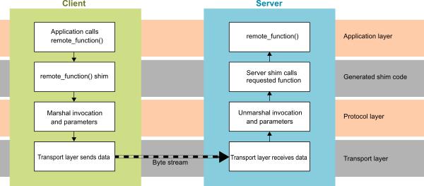

Introduction                         {#mainpage}
=================

eRPC (Embedded Remote Procedure Call) is an open source RPC system with a focus on constrained embedded environments.

Generally, RPC is a mechanism used to invoke a software routine on a remote system via a simple local function call. The remote system may be any CPU connected by an arbitrary communications channel: a server across a network, another CPU core in a multicore system, and so on. To the client, it is just like calling a function in a library built into the application. The only difference is any latency or unreliability introduced by the communications channel.

When a remote function is called by the client, the function's parameters and an identifier for the called routine are marshalled (or serialized) into a stream of bytes. This byte stream is transported to the server through a communications channel (IPC, TPC/IP, UART, etc). The server unmarshals the parameters, determines which function was invoked, and calls it. If the function returns a value, then it is marshalled and sent back to the client.

Here is a block diagram of an RPC system:

This diagram only shows one direction of communication; it leaves out the reply from the server to send the invoked function's return value. This reply uses basically the same sequence of events, but flowing back from the server to the client.

RPC implementations typically use combination of a tool (`erpcgen` in our case) and IDL (interface definition language) file to generate source code to handle the details of marshalling a function's parameters and building the data stream. The tool also generates code for a server side shim that knows how to unmarshal a request and call the appropriate function. The IDL input is used to tell the generator tool about data types and RPC services.
